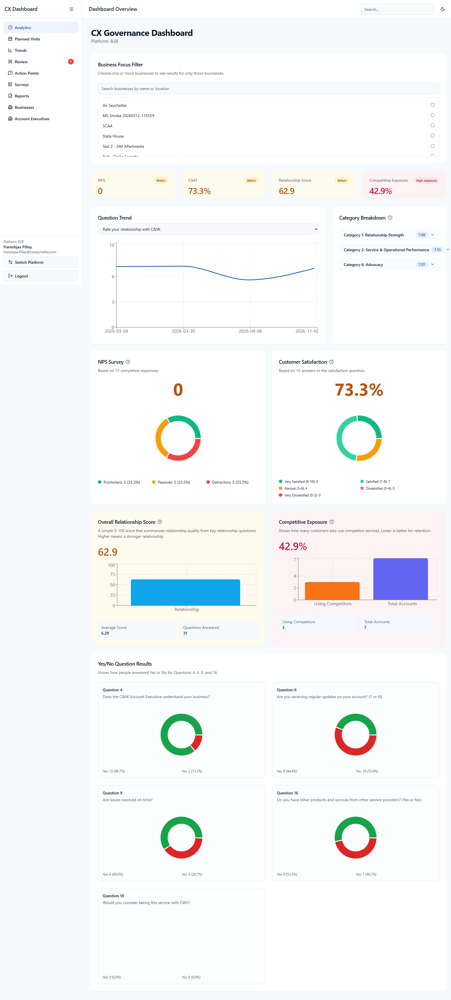
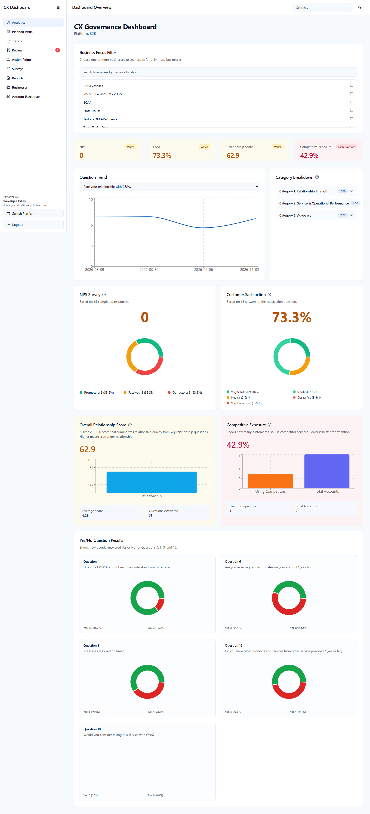
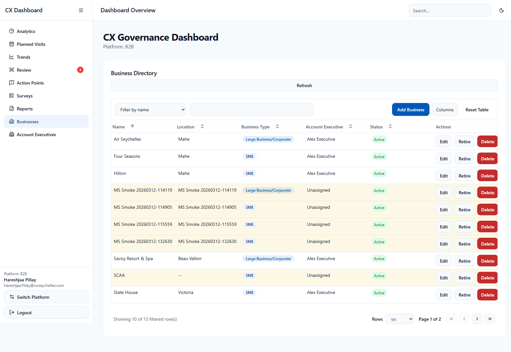
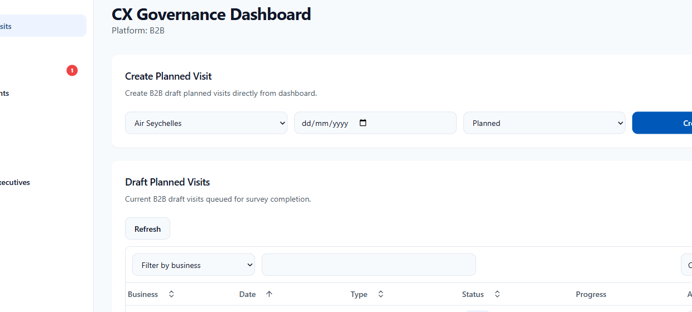
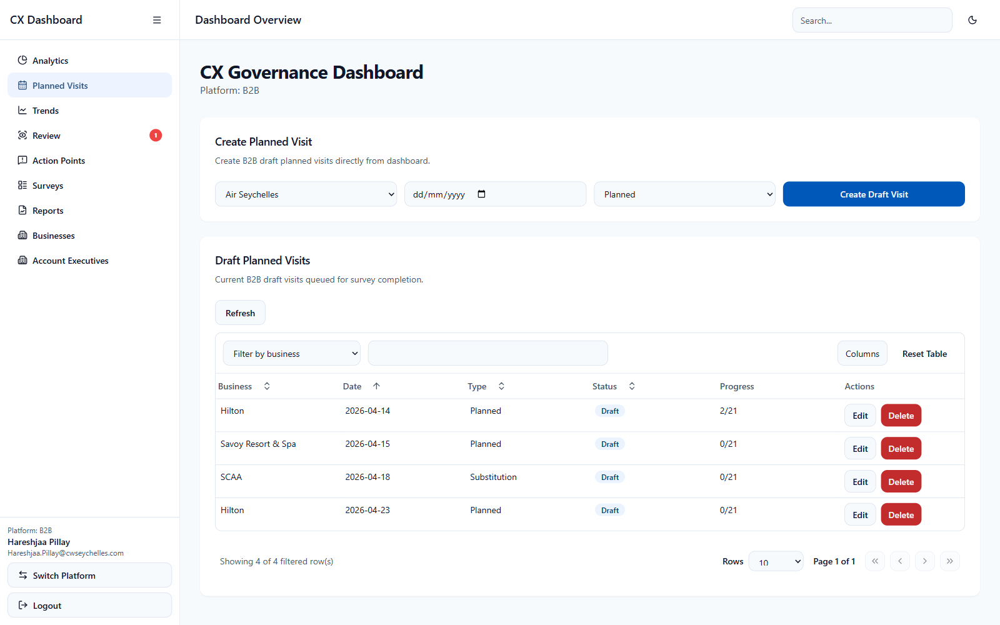

# Governance Dashboard - B2B Platform User Guide

This guide explains the B2B area of the Governance Dashboard in simple, non-technical language.

The dashboard is mainly used by managers, supervisors, and administrators to review performance, check submitted surveys, and keep core data up to date.

---

## 1) What This Dashboard Is For

The B2B dashboard helps you:

- monitor performance
- review submitted surveys
- manage businesses and account executives
- manage planned visits
- open reports and results

This is not the place where field users normally complete surveys. This is the place where supervisors and managers review what has already been captured.

---

## 2) Accessing The B2B Dashboard

### Step by step

1. Open the Governance Dashboard link.
2. If a security warning appears, click **Advanced**.
3. Click **Proceed to site** or **Continue to website**.
4. Sign in with your work account.
5. On the platform selection screen, choose **B2B**.

### Access required

- B2B Admin
- Super Admin

### How you know you are in the right place

You should see pages such as:

- Analytics
- Review
- Planned Visits
- Surveys
- Reports
- Businesses
- Account Executives
- User Guide

**Image:**

---

## 3) Simple Overall Flow

Most users will use the dashboard in this order:

1. open **Analytics** to see overall performance
2. open **Review** to process pending submissions
3. open **Planned Visits** to manage upcoming work
4. open **Businesses** and **Account Executives** to maintain master data
5. open **Surveys** or **Reports** when you need detailed records

This order helps you move from overview to detail.

---

## 4) Page: Analytics

This is the main overview page.

### What this page is for

- understanding overall B2B performance
- checking KPI health
- spotting low-performing areas
- reviewing business trends over time

### What you should look at first

Start with the top KPI cards. These give you a quick picture of how things are going.

Then look at the charts and tables underneath to understand why the numbers look that way.

### Step by step

1. Open **Analytics**.
2. Review the KPI cards at the top.
3. If filters are available, choose the correct date range or business filters.
4. Look at category and question trends.
5. Identify weak areas that may need follow-up.

### What you can do

- review NPS, CSAT, relationship score, and competitive exposure
- compare performance over time
- filter by business or other selected scope

### What you cannot do

- approve surveys from this page
- edit survey answers from this page

### Good habit

Do not react to one card only. Always look at the supporting tables and charts underneath before making a decision.

**Image:**

---

## 5) Page: Review

This page is used to process submitted surveys that are waiting for a decision.

### What this page is for

- checking the quality of a submitted survey
- approving valid submissions
- rejecting or sending back incorrect submissions

### Why this page matters

Only approved data should be treated as trusted reporting data.

If surveys are not reviewed properly, reporting may become misleading.

### Step by step

1. Open **Review**.
2. Select a pending visit.
3. Read the responses carefully.
4. Check comments, action points, and any edited values.
5. Decide whether to approve, reject, or request changes.

### What you can do

- review answers in detail
- approve or reject submissions
- make sure only good-quality data moves forward

### What you cannot do

- complete the review without first opening a visit
- treat this page as a reporting page only

### Good habit

Read the survey slowly before taking action. Do not approve just to clear the queue.

**Image:**

---

## 6) Page: Businesses

This page holds the business master list used by the B2B platform.

### What this page is for

- creating a new business
- updating business details
- retiring businesses that are no longer active

### Why this page matters

If the business list is wrong, users may choose the wrong business in the survey process.

### Step by step

1. Open **Businesses**.
2. Search for the business first.
3. If it exists, edit the record if needed.
4. If it does not exist, add a new business.
5. Confirm the account executive assignment is correct.

### What you can do

- keep the business directory accurate
- assign the correct account executive
- retire businesses that should not be used anymore

### What you cannot do

- remove records carelessly
- assume old data is still correct without checking it

**Image:**

---

## 7) Page: Planned Visits

This page is used to prepare future survey work.

### What this page is for

- creating planned visits
- changing visit dates
- keeping the survey queue organized

### Step by step

1. Open **Planned Visits**.
2. Select the business.
3. Choose the visit date.
4. Choose the visit type if needed.
5. Save the planned visit.

### What you can do

- prepare the survey workload in advance
- update the date or type when plans change
- remove incorrect draft visits

### What you cannot do

- change the business when editing an existing planned visit

### Good habit

Keep planned visits accurate. Survey users depend on this list to find the correct work.

**Image:**

---

## 8) Page: Survey Results

This page helps you find and inspect submitted survey records.

### What this page is for

- finding a specific survey
- checking survey history
- reviewing completed records in detail

### Step by step

1. Open **Surveys**.
2. Use filters such as status, business, or date.
3. Open the result you want to inspect.
4. Review the detailed answers and progress information.

### What you can do

- audit past submissions
- inspect detailed survey content

### What you cannot do

- edit a finished survey directly from this page

**Image:**

---

## 9) Page: Reports

This page is used when you need a report view rather than a screen view.

### What this page is for

- previewing reports
- reviewing summary information before sending
- emailing report output where allowed

### Good habit

Always preview a report before sending it, especially if the report is for management or an external audience.

---

## 10) Page: Account Executives

This page helps keep the account executive directory clean and usable.

### What this page is for

- creating account executive records
- updating names and email addresses

### Why this matters

Account executive information appears in business records, survey records, and reporting.

---

## 11) Navigation Tips

Use the left menu to move between dashboard pages.

The easiest way to work is:

- **Analytics** for overview
- **Review** for decisions
- **Businesses** and **Account Executives** for setup
- **Planned Visits** for scheduling
- **Surveys** and **Reports** for detailed checking
- **User Guide** when you need help

---

## 12) Common Mistakes To Avoid

- approving a survey without reviewing it properly
- creating duplicate businesses
- assigning the wrong account executive
- forgetting to update planned visits after schedule changes
- reading KPI cards without checking the detailed charts underneath

---

## 13) Common Situations

- **No data shown**
  - Clear filters and reapply them one by one.

- **Numbers look wrong**
  - Check the selected date range and selected business scope.

- **A record seems missing**
  - Check the survey status and date filters.

- **An action is disabled**
  - Check your role permissions.

---

## 14) Getting Help

If something goes wrong:

1. take a screenshot
2. note the page name
3. note what you were trying to do
4. send the details to your administrator or supervisor
