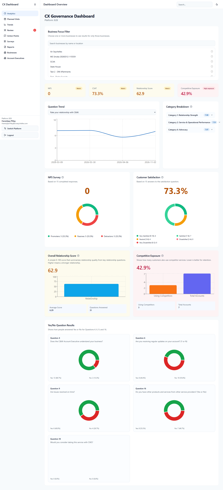
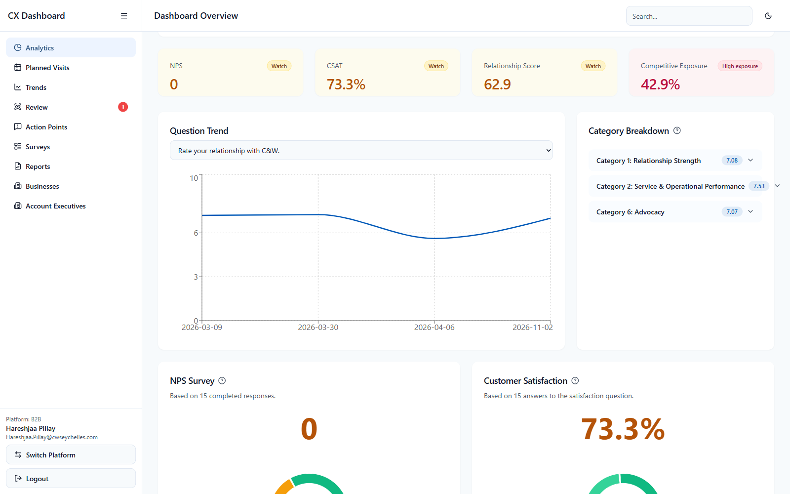
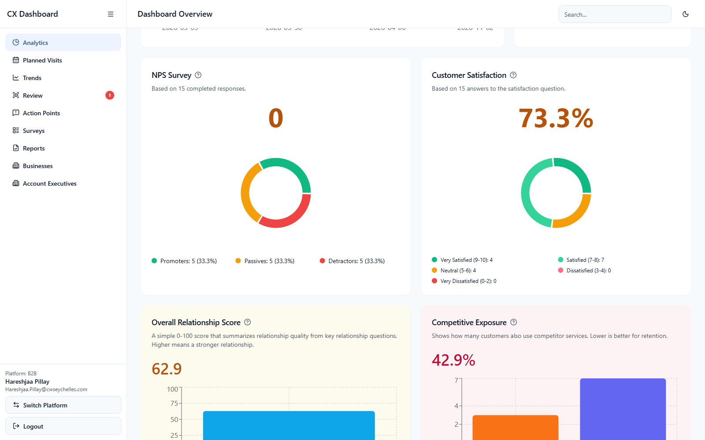

# Governance Dashboard - Installation Assessment Platform User Guide

This guide explains the Installation Assessment area of the Governance Dashboard in simple, non-technical language.

This dashboard is used to review installation performance, explore submitted assessments, manage contractors, and produce reports.

---

## 1) What This Dashboard Is For

The Installation dashboard helps you:

- review average installation quality scores
- compare contractor and field team performance
- inspect submitted assessments
- manage the contractor directory
- preview or send reports

This area is mainly for supervisors, managers, administrators, and people responsible for checking installation quality.

---

## 2) Accessing The Installation Dashboard

### Step by step

1. Open the Governance Dashboard link.
2. If a security warning appears, click **Advanced**.
3. Click **Proceed to site** or **Continue to website**.
4. Sign in with your work account.
5. Select **Installation Assessment** from the platform selection page.

### Access required

- Installation Admin
- Super Admin

### How you know you are in the right place

You should see pages such as:

- Analytics
- Trends
- Surveys
- Reports
- Contractors
- User Guide

**Image:**

---

## 3) Simple Overall Flow

The easiest way to use this dashboard is:

1. open **Analytics** for the summary view
2. open **Trends** to see score movement over time
3. open **Surveys** to inspect detailed assessments
4. open **Reports** when you need a report output
5. open **Contractors** to manage contractor names used in the survey app

This order helps you move from summary to detail.

---

## 4) Page: Analytics

This page gives you the main picture of installation quality.

### What this page is for

- seeing overall average performance
- comparing customer type performance
- comparing worker type performance
- reviewing contractor breakdown performance

### What to look at first

Start with the summary cards at the top.

Then review the charts below to understand which areas or contractor groups may need attention.

### Step by step

1. Open **Analytics**.
2. Review the summary cards.
3. Compare worker and contractor results.
4. Look for low averages or unusual gaps.
5. Use this information to decide what needs follow-up.

### What you can do

- compare overall and grouped results
- review contractor-level performance
- identify weak areas before opening detailed records

### What you cannot do

- edit a survey from this page
- complete a new assessment from this page

**Image:**

---

## 5) Page: Trends

This page shows how average scores change over time.

### What this page is for

- spotting improvement or decline
- checking whether quality is stable over time

### Good habit

Do not judge a trend from one point only. Look at the full line or grouped pattern before making a decision.

---

## 6) Page: Surveys

This page helps you find individual assessments and review them in detail.

### What this page is for

- finding a submitted installation assessment
- opening the detail view for a specific survey
- checking worker details, customer details, and question scores

### Step by step

1. Open **Surveys**.
2. Use the filters if needed.
3. Open the required survey.
4. Review the details, scores, contractor name, or field team member names.

### Why this matters

This page helps you move from summary reporting to the exact record behind the numbers.

---

## 7) Page: Reports

This page is used to create a report view of installation results.

### What this page is for

- previewing a report before sending it
- reviewing the report layout and KPI summary
- emailing the report where needed

### Good habit

Always preview the report before sending it. This helps you confirm the date range, survey scope, and visible score summary are correct.

---

## 8) Page: Contractors

This page manages the contractor names available in the installation survey app.

### What this page is for

- adding contractor names
- searching the contractor directory
- keeping contractor reporting clean and consistent

### Why this page matters

If contractor names are entered inconsistently, the analytics can become split across similar names. Using one clean list keeps reporting accurate.

### Step by step

1. Open **Contractors**.
2. Search for the contractor first.
3. If the contractor already exists, use the existing name.
4. If it does not exist, add it once with the correct spelling.

### Good habit

Before creating a new contractor, search carefully to avoid duplicates.

**Image:**

---

## 9) Navigation Tips

Use the left menu to move between pages.

The easiest order is:

- **Analytics** for overview
- **Trends** for change over time
- **Surveys** for detailed inspection
- **Reports** for report output
- **Contractors** for master data setup
- **User Guide** if you need help

---

## 10) Common Mistakes To Avoid

- creating duplicate contractor names
- reading averages without checking the detailed records behind them
- sending reports without previewing them first
- ignoring worker type and contractor breakdown when reviewing quality issues

---

## 11) Common Situations

- **You cannot find a contractor in the survey app**
  - Add it in the dashboard contractor directory first.

- **A score looks wrong**
  - Open the survey detail page to confirm the actual answers behind the number.

- **You cannot find the survey you need**
  - Check the filters, especially date and worker type.

- **A report looks incomplete**
  - Check the selected report scope and preview it again.

---

## 12) Getting Help

If something goes wrong:

1. take a screenshot
2. note the page name
3. note what you were trying to do
4. send that information to your administrator or supervisor
