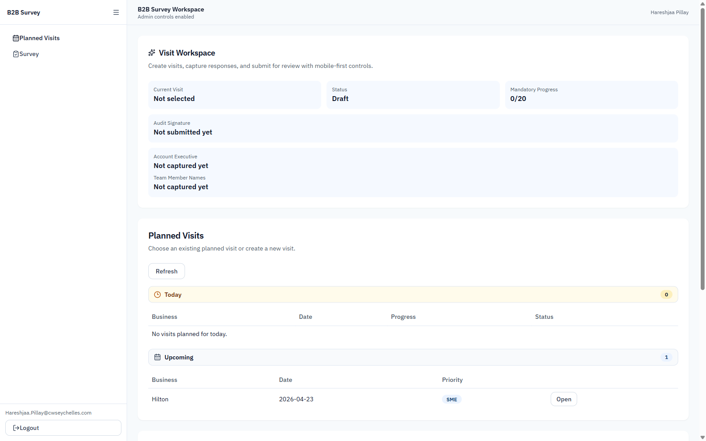
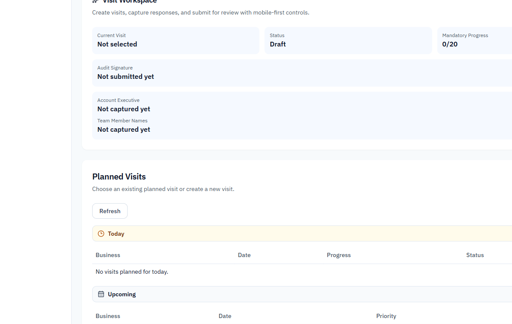
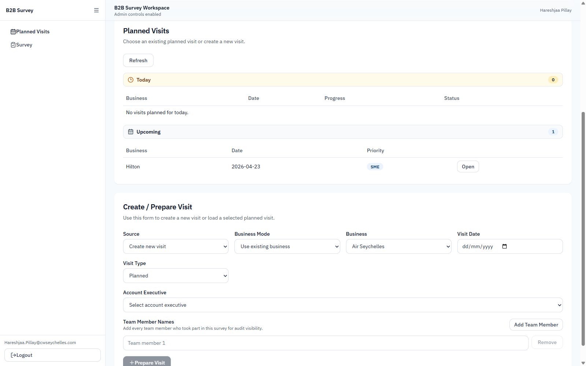
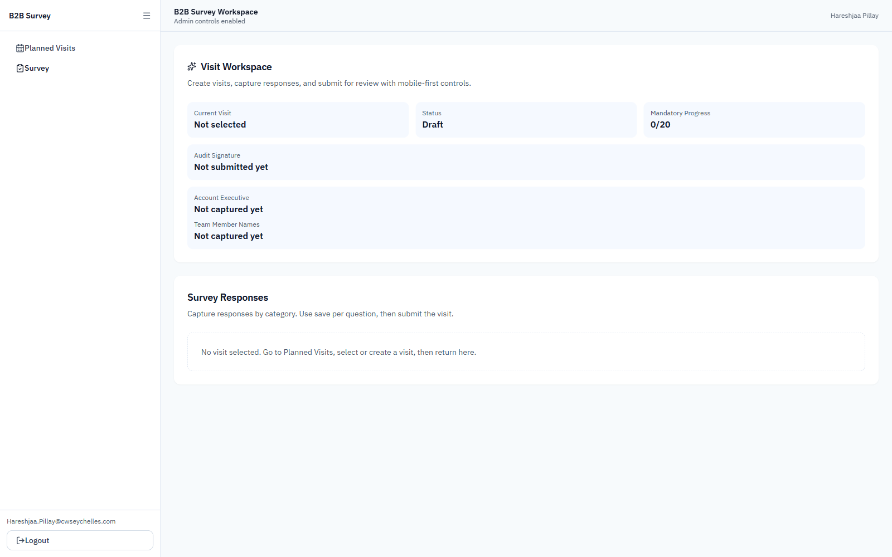
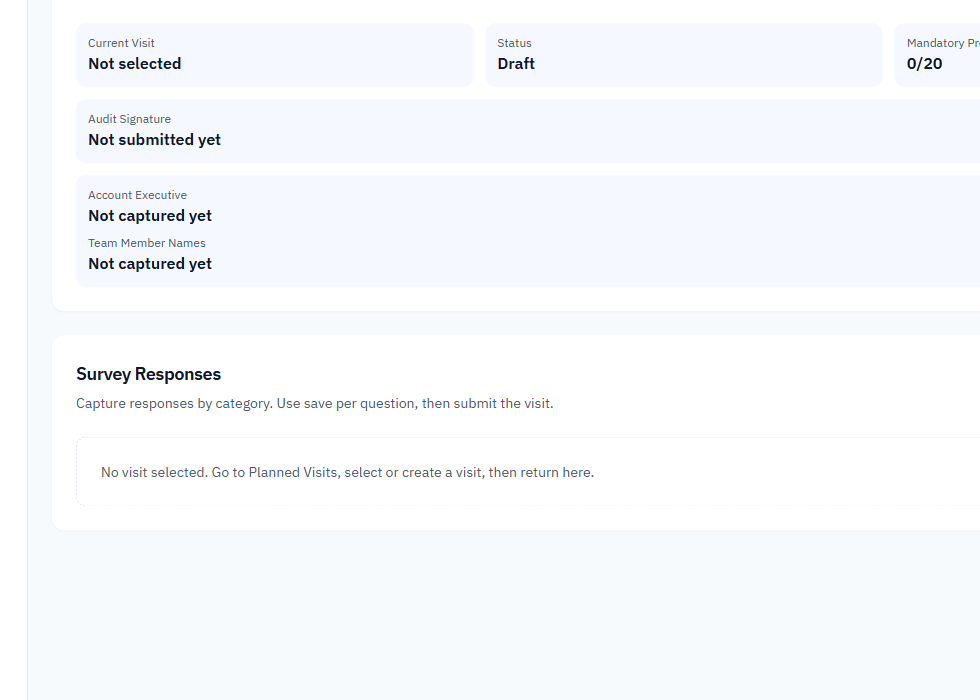
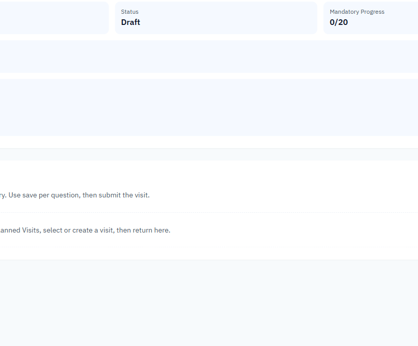
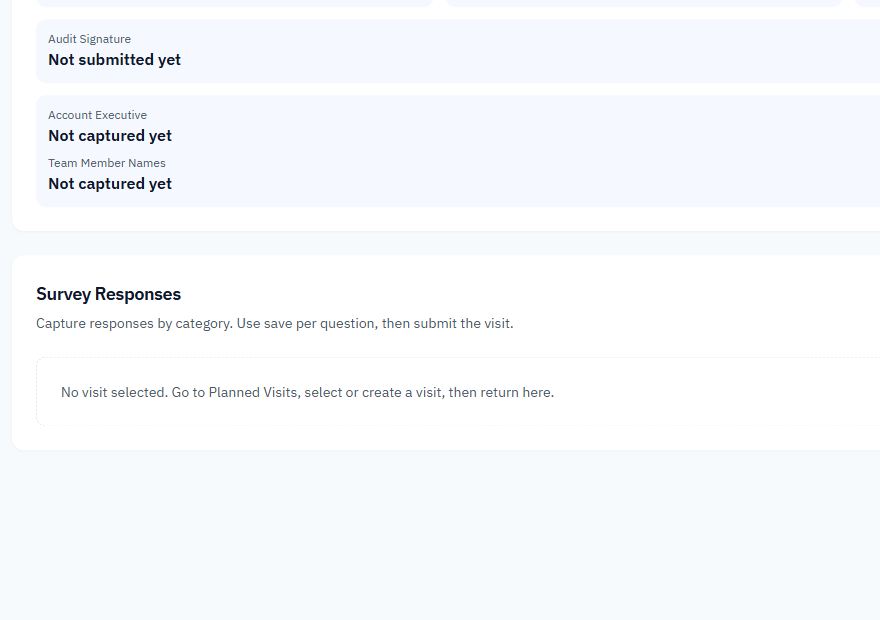
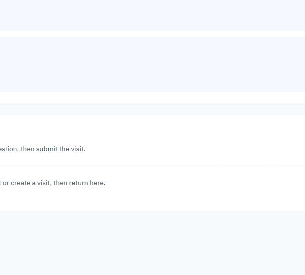

# B2B Survey User Guide

This guide explains the B2B Survey in simple, non-technical steps.

---

## 1) Getting Access

1.1 Open the B2B Survey link.

1.2 If a security warning appears, click **Advanced**.

1.3 Click **Proceed to site** (or **Continue to website**).

1.4 Sign in with your work account.

1.5 Confirm the B2B Survey page has loaded.

**Images:**

---

## 2) Quick End-to-End Flow

2.1 Open B2B Survey.

2.2 Choose **New** or **Draft**.

2.3 Complete survey details.

2.4 Complete questions by category.

2.5 Save Draft if not finished.

2.6 Submit when all required items are complete.

---

## 3) Page: Planned Visits (If Enabled)

3.1 Open **Planned Visits**.

3.2 Review available visits.

3.3 Select the visit you need.

3.4 Open survey workspace from that visit.

### What you can do

- Select a visit to start work.
- Review visit status before starting.

### What you cannot do

- You cannot submit a final survey from this page.

**Images:**

---

## 4) Page: Survey Workspace

4.1 Choose **New** to start fresh or **Draft** to continue saved work.

4.2 If Draft is selected, choose the correct draft.

4.3 Fill required top details (business/site/date).

4.4 Open first category.

4.5 Answer required questions.

4.6 Add notes where needed.

4.7 Move to next category and repeat.

### What you can do

- Create and update survey responses.
- Save work and continue later.
- Track completion while answering.

### What you cannot do

- You cannot skip required fields and submit.
- You cannot recover unsaved changes after abrupt close.

**Images:**

---

## 5) Page: Review and Save/Submit

5.1 Check completion status.

5.2 Click **Save Draft** if you will continue later.

5.3 Click **Submit** only when all required items are complete.

### What you can do

- Save partially completed work.
- Submit completed surveys.

### What you cannot do

- You cannot edit finalized submissions unless reopened by an authorized user.

**Images:**

---

## 6) Common Situations

- **Situation:** Draft is not listed.
  - **What to do:** Switch to Draft mode and refresh/select again.

- **Situation:** You need to stop now.
  - **What to do:** Save Draft before leaving.

- **Situation:** A question is unclear.
  - **What to do:** Add a short note and review before submit.

---

## 7) Getting Help

7.1 Take a screenshot.

7.2 Note the page and action.

7.3 Send details to your administrator.
