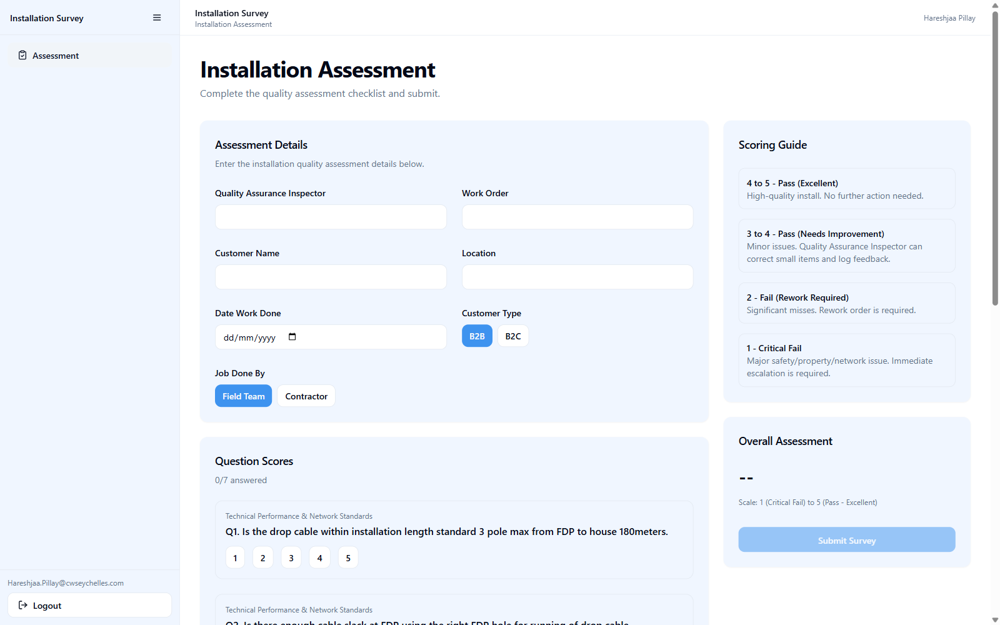
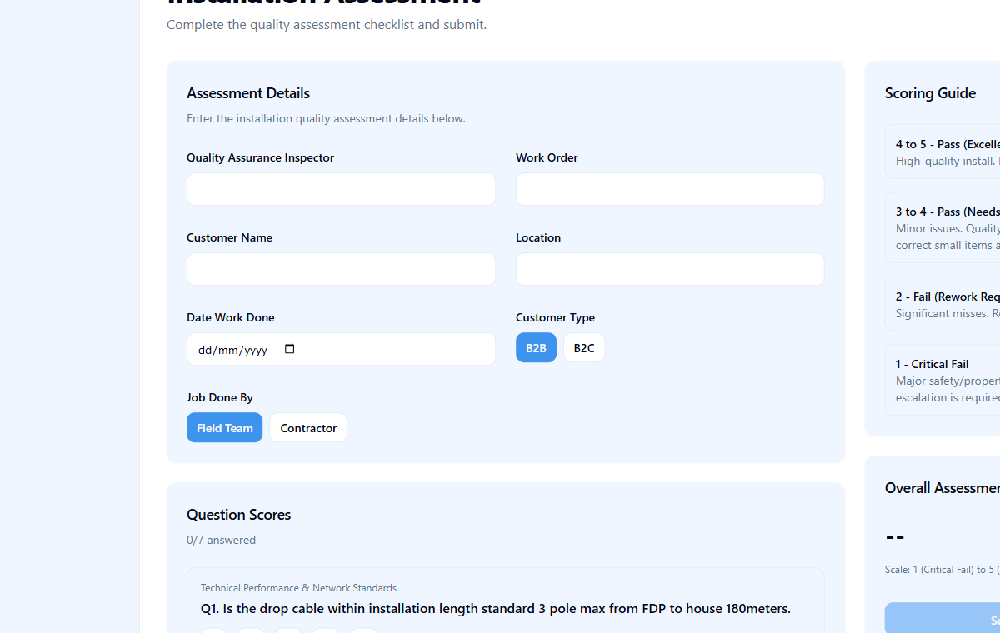
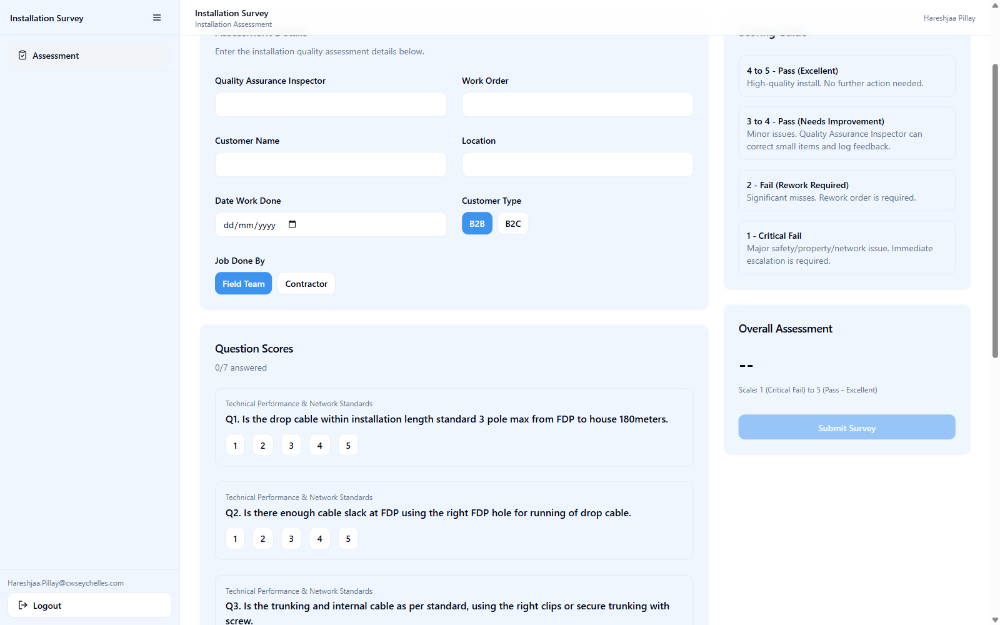
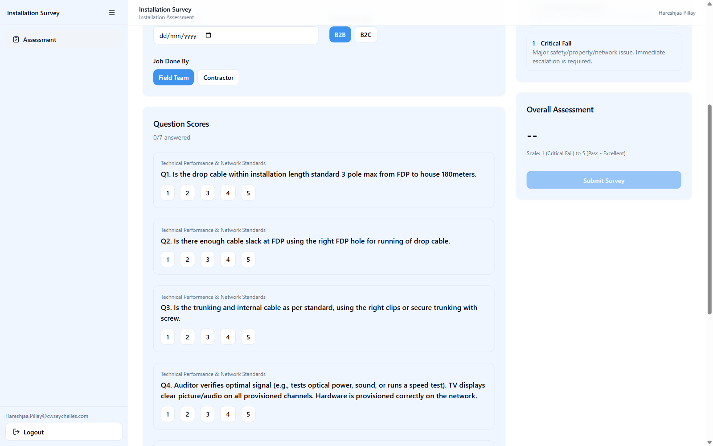
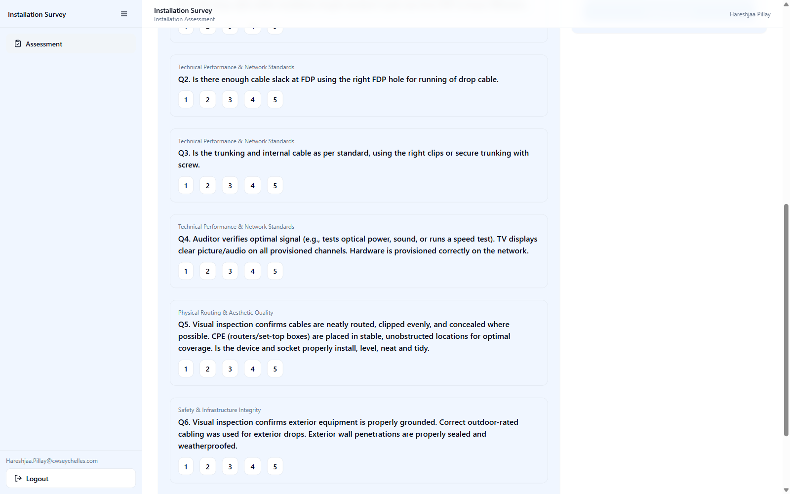
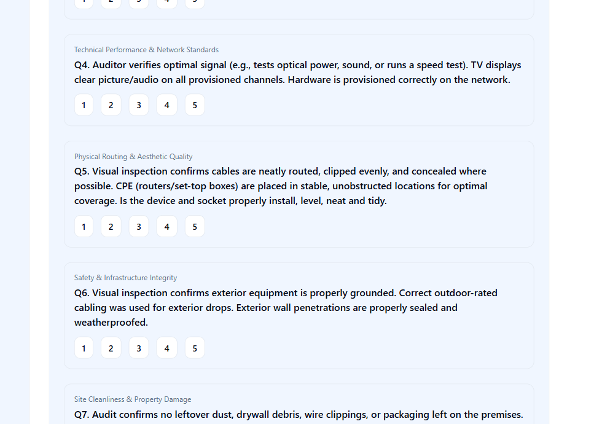
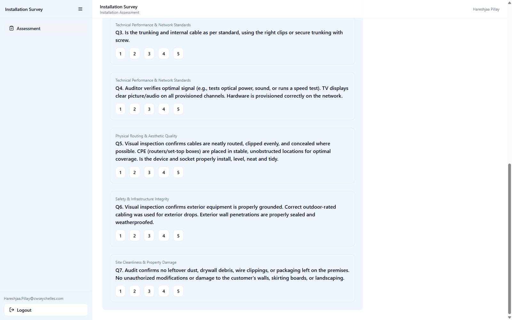
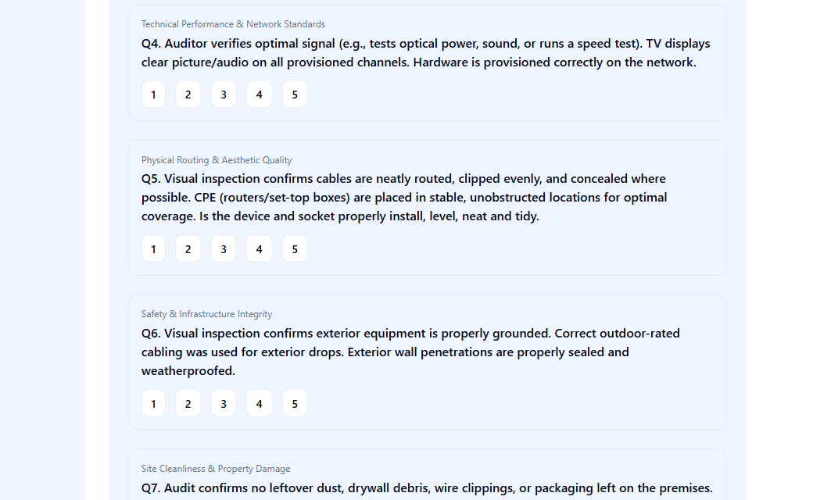
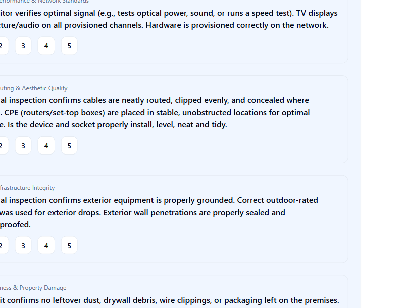
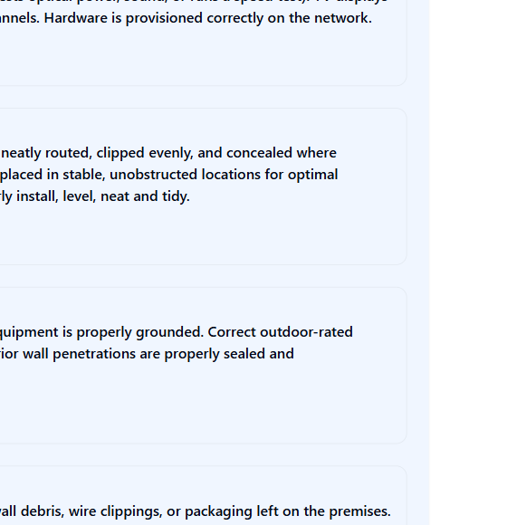

# Installation Assessment Survey User Guide

This guide explains the Installation Assessment Survey in simple, non-technical steps.

---

## 1) Getting Access

1.1 Open the Installation Assessment Survey link.

1.2 If a security warning appears, click **Advanced**.

1.3 Click **Proceed to site** (or **Continue to website**).

1.4 Sign in with your work account.

1.5 Confirm the Installation Assessment page has loaded.

**Images to place here:**

---

## 2) Quick End-to-End Flow

2.1 Choose **New** or **Draft**.

2.2 Complete installation details.

2.3 Review the scoring guide.

2.4 Score questions using 1 to 5.

2.5 Complete required categories.

2.6 Save Draft or Submit.

---

## 3) Page: Start (New or Draft)

3.1 Choose **New** to start a new assessment.

3.2 Choose **Draft** to continue saved work.

3.3 If Draft is selected, choose the correct draft.

### What you can do

- Start a new assessment.
- Continue from an existing draft.

### What you cannot do

- You cannot continue a draft without selecting it.

**Images to place here:**

---

## 4) Page: Installation Details and Scoring

4.1 Enter required details (inspector, customer, segment, location, date, team).

4.2 Open first category.

4.3 Score each question using only **1 to 5** buttons.

4.4 Move through all categories.

4.5 Use progress to find incomplete questions.

### What you can do

- Capture installation details.
- Score by category on the 1 to 5 scale.
- Track completion while working.

### What you cannot do

- You cannot use scores outside 1 to 5.
- You cannot skip required questions/details and submit.

**Images to place here:**

---

## 5) Page: Review and Save/Submit

5.1 Click **Save Draft** if you are not finished.

5.2 To remove a draft, select it and click **Delete Draft**.

5.3 Click **Submit** only after all required items are complete.

### What you can do

- Save work in progress.
- Delete an unwanted draft.
- Submit completed assessment.

### What you cannot do

- You cannot submit incomplete required responses.

**Images to place here:**

---

## 6) Common Situations

- **Situation:** Date field shows an error.
  - **What to do:** Re-enter date using the date picker.

- **Situation:** Score does not look selected.
  - **What to do:** Click the score again and confirm it is highlighted.

- **Situation:** Duplicate draft warning appears.
  - **What to do:** Switch to Draft mode and continue with the existing draft.

---

## 7) Getting Help

7.1 Take a screenshot.

7.2 Note the page and action.

7.3 Send details to your administrator.
